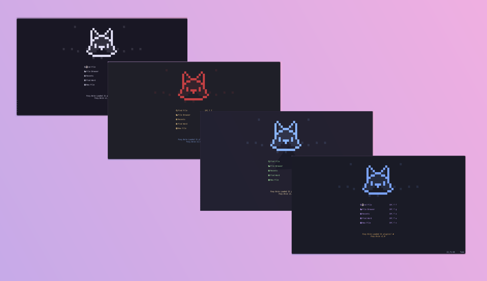
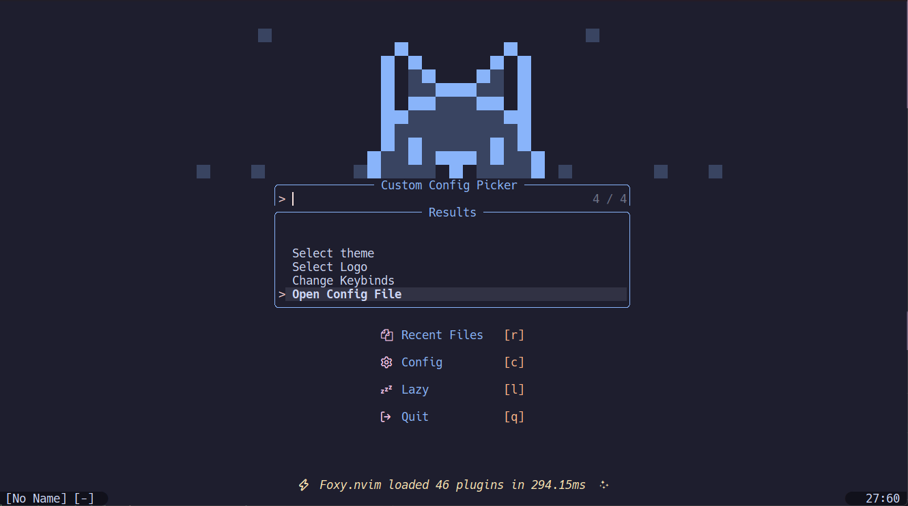
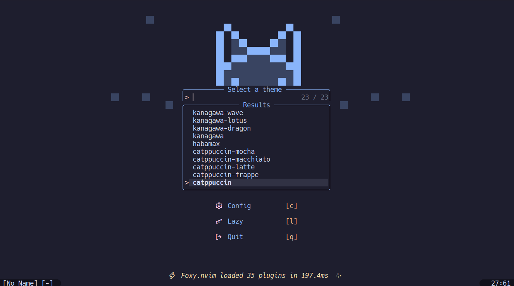
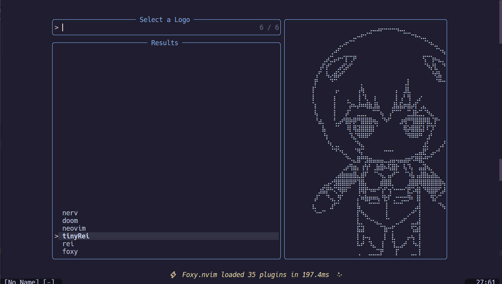
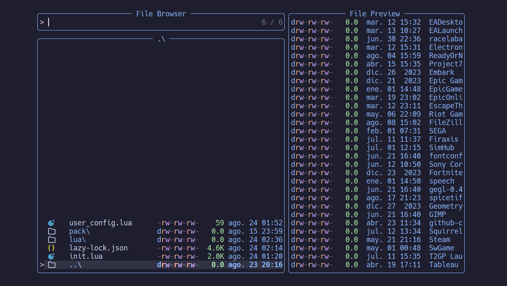
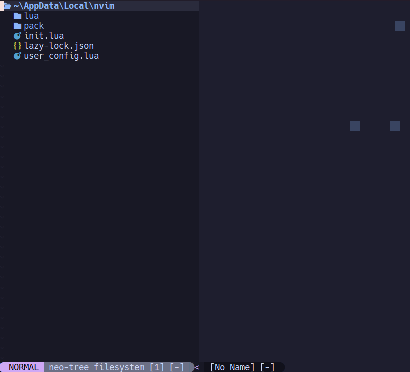
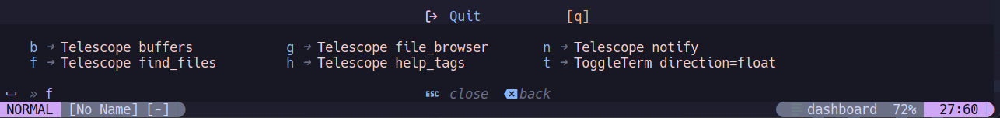
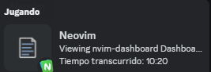

<h1 align="center">
Foxy.nvim
</h1>

	Foxy.nvim is a neovim setup made to make most of the installation and configuration of neovim easier.

	
	

  

## Features

### Config picker
Set configs easily in home page

### Theme picker
Set theme with live preview

### Select dashboard art
Set ascii art for dashboard

### Distinct file browsers
|----------|------------|
|||

### Cheat sheet

### Snippets, autocomplete, lints

  
  

### Presence on discord

	  

## Setup :wrench:

- Install [Neovim](http://neovim.io/) version 0.10.0 or higher.
- Make sure you have [`git`](https://git-scm.com) installed, [npm](https://nodejs.org/en) and [yarn](https://classic.yarnpkg.com/lang/en/docs/install).
- Make sure you have a c compiler installed (for example, `gcc` or `clang`). If you are using windows you can use [MinGW](https://www.mingw-w64.org) or [LLVM](https://community.chocolatey.org/packages/llvm).
- Insatll [lua](https://www.lua.org/download.html) if you are using windows follow this [instructions](./installLua.md).
- Install [LuaRocks](https://luarocks.org)
- Clone this repository into `~/.config/nvim` or `%LOCALAPPDATA%\nvim` on Windows.
- Open nvim and wait for the plugins to install.
- Restart nvim. Now you should be good to go!

## TODO :construction:
- [ ] Add more themes
- [ ] Make bash scripts for setup
- [ ] Add more plugins
- [ ] Add more snippets
- [ ] Make wiki for the project
- [ ] Add more ascii art

## Credits
This project is inspired by:
- [Craftzdog (devaslife) dotfiles](https://github.com/craftzdog/dotfiles-public) check his youtube channel [here](https://www.youtube.com/@devaslife))

## Contributing :tada:
If you want to contribute to this project, feel free to fork this repository and make a pull request. I will be happy to review it. If you have any questions, feel free to open an issue. I will be happy to help you. :smile: